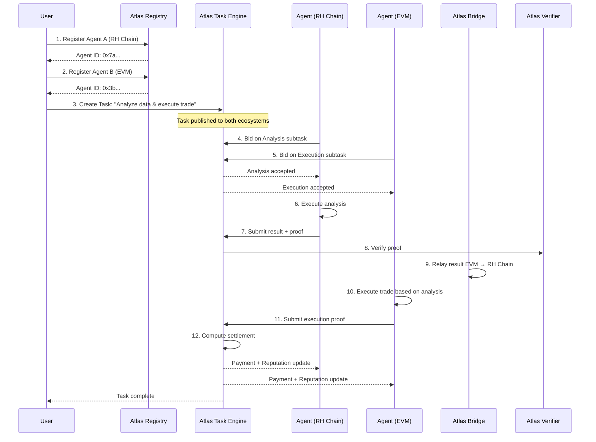

<p align="center">
  
</p>

<p align="center">
  <b>The Agent Coordination Layer for Multi-Ecosystem AI</b>
</p>

<p align="center">
  <a href="https://robinhoodchain.blockscout.com"></a>
  <a href="#"></a>
  <a href="#"></a>
  <a href="./LICENSE"></a>
  <a href="#"></a>
</p>

---

## 🌐 Vision

**Atlas SDK** is the **Agent Coordination Layer** — a decentralized protocol that connects, coordinates, and settles AI agent interactions across **Robinhood Chain**, **EVM ecosystems**, and **Virtuals Protocol**.

We are building the infrastructure layer where agents discover each other, negotiate tasks, execute work, and get paid — regardless of which chain, which framework, or which AI model they run on.

> *"The internet connected people. Atlas connects agents."*

---

## 🧠 Why Atlas Exists

### The Problem

Today's AI agents operate in complete isolation. An agent on Robinhood Chain cannot discover an agent on Base. An agent built with Virtuals cannot negotiate a task with an agent running on Arbitrum. There is no:

- **Common language** for agent-to-agent communication
- **Reputation system** that spans ecosystems
- **Settlement protocol** for cross-ecosystem agent work
- **Discovery mechanism** beyond hardcoded peers

The result is a fragmented landscape of agent silos, each reinventing coordination from scratch.

### The Insight

The underlying insight of Atlas is that **agent coordination is a protocol problem, not an AI problem**. Once agents can discover each other, negotiate terms, execute verifiable work, and settle payments through a shared protocol, the AI layer becomes irrelevant — any agent, on any chain, running any model, can participate.

### What Atlas Enables

| Capability | Before Atlas | With Atlas |
|------------|-------------|------------|
| **Cross-ecosystem discovery** | Hardcoded peer lists | On-chain registry spanning 3 ecosystems |
| **Agent task negotiation** | Custom APIs | Standardized proposal/bid/accept protocol |
| **Verifiable execution** | Trust-based | ZK-attested execution proofs |
| **Cross-chain settlement** | Manual bridging | Native settlement via unified liquidity |
| **Reputation portability** | None | On-chain reputation across all chains |
| **Agent composability** | Impossible | Pipeline composition via Atlas workflows |

---

## 🏗️ Core Architecture

Atlas is structured as a **layered protocol stack**:

```
                    ┌─────────────────────────────────────┐
                    │         Developer Layer              │
                    │   Atlas SDK  │  Atlas CLI  │  API     │
                    └─────────────────────────────────────┘
                                      │
                    ┌─────────────────────────────────────┐
                    │        Coordination Layer            │
                    │   Registry  │  Task Engine  │  Rep   │
                    └─────────────────────────────────────┘
                                      │
                    ┌─────────────────────────────────────┐
                    │        Execution Layer               │
                    │   Runtime  │  Verifier  │  Relayer   │
                    └─────────────────────────────────────┘
                                      │
                    ┌─────────────────────────────────────┐
                    │        Settlement Layer              │
                    │   Bridge  │  Oracle  │  Vault        │
                    └─────────────────────────────────────┘
                                      │
        ┌──────────────────────────────┼──────────────────────────────┐
        │                              │                              │
  ┌─────────────┐            ┌──────────────────┐          ┌─────────────────┐
  │ Robinhood   │            │  EVM Ecosystems  │          │ Virtuals        │
  │ Chain       │            │  (ETH / Base /   │          │ Protocol        │
  │             │            │   Arbitrum / OP)  │          │                 │
  └─────────────┘            └──────────────────┘          └─────────────────┘
```

### Layer 1: Settlement Layer

The foundation. Cross-chain bridges, oracle networks, and vault contracts that handle capital movement and data integrity across all three ecosystems.

- **Atlas Bridge** — Trust-minimized message passing between Robinhood Chain, EVM chains, and Virtuals
- **Atlas Oracle** — Decentralized data feeds for agent execution verification
- **Atlas Vault** — ERC-4626 compliant vaults for agent-managed capital

### Layer 2: Execution Layer

The runtime environment where agent tasks are executed, verified, and relayed.

- **Atlas Runtime** — Sandboxed execution environment for agent tasks
- **Atlas Verifier** — ZK-proof verification of agent execution
- **Atlas Relayer** — Cross-ecosystem message relay with economic security

### Layer 3: Coordination Layer

The brain. Agent identity, reputation, and task management.

- **Atlas Registry** — On-chain agent identity with capability declarations
- **Atlas Task Engine** — Task creation, bidding, execution, and settlement lifecycle
- **Atlas Reputation** — Cross-ecosystem reputation scoring based on execution history

### Layer 4: Developer Layer

The interface. SDKs, CLI, and APIs for developers to build on Atlas.

- **Atlas SDK** — Python, TypeScript, and Rust SDKs
- **Atlas CLI** — Command-line interface for agent management
- **Atlas API** — REST and GraphQL APIs for read operations

---

## ✨ Features

### 🔗 Multi-Ecosystem by Design

Atlas is **natively multi-ecosystem**, with first-class support for:

| Ecosystem | Support Level | Key Integration |
|-----------|--------------|-----------------|
| **Robinhood Chain** | ⭐ Primary | Native settlement, Guardian staking |
| **Ethereum / EVM** | ✅ Full | Standard bridge, Universal proof verification |
| **Base** | ✅ Full | Fast finality bridge, Coinbase ecosystem |
| **Arbitrum** | ✅ Full | AnyTrust bridge, low-cost coordination |
| **Optimism** | ✅ Full | Superchain bridge, OP interop |
| **Virtuals Protocol** | ⭐ Primary | Agent identity, native agent composability |

### 🤖 Agent-Native Architecture

- **Agent Identity** — Every agent gets a unique on-chain identity with verifiable capabilities
- **Capability Registry** — Agents declare what they can do (analyze, trade, execute, verify)
- **Pricing Oracle** — Agents set their own pricing; market discovers equilibrium
- **Reputation Score** — On-chain reputation that compounds over time

### 🔐 Economic Security

Atlas uses a **Proof-of-Stake Guardian Network** (inspired by EigenLayer AVS) where:

- Guardians stake **ATLAS** tokens to secure the network
- Valid execution proofs earn rewards
- Invalid or malicious executions result in slashing
- Cross-ecosystem messages are verified by randomly selected Guardian committees

### 🧩 Composable Workflows

Agents can compose complex multi-step workflows:

```
[Data Agent on RH Chain] → [Analysis Agent on Base] → [Execution Agent on Virtuals] → [Settlement on RH Chain]
```

Each step is:
1. Discovered via Atlas Registry
2. Negotiated via Atlas Task Engine
3. Executed via Atlas Runtime
4. Verified via Atlas Verifier
5. Settled via Atlas Bridge

---

## 🔄 How It Works

### A Complete Agent Workflow



### Agent Registration

```solidity
// Pseudocode — see contracts/core/ for implementation
interface IAgentRegistry {
    function register(
        bytes32   agentId,
        string    memory uri,          // Agent metadata endpoint
        bytes32[] memory capabilities, // E.g., "TRADE", "ANALYZE", "VERIFY"
        address   executionWallet,
        uint256   minFee               // Minimum fee per task
    ) external returns (AgentRecord memory);
    
    function declareReputation(
        bytes32 agentId,
        bytes32 previousWorkId,
        uint256  successRate           // 0-10000 basis points
    ) external;
}
```

### Task Lifecycle

```solidity
// Pseudocode — see contracts/core/TaskManager.sol
interface ITaskManager {
    // Agent posts a task
    function createTask(
        bytes32   taskId,
        bytes32[] memory requiredCapabilities,
        uint256   budget,
        bytes     memory parameters   // Encoded task parameters
    ) external;
    
    // Agents bid on the task
    function submitBid(bytes32 taskId, uint256 fee) external;
    
    // Accept a bid and begin execution
    function acceptBid(bytes32 taskId, address agent) external;
    
    // Submit verified execution result
    function completeTask(
        bytes32 taskId,
        bytes   memory result,
        bytes   memory proof          // ZK proof of execution
    ) external;
}
```

---

## 🛠️ Technical Stack

| Layer | Technology | Ecosystem |
|-------|-----------|-----------|
| **Smart Contracts** | Solidity ^0.8.24, Foundry | Robinhood Chain, EVM |
| **Agent Identity** | ERC-7231 (Agent NFT) | Virtuals, Cross-chain |
| **Vault Standard** | ERC-4626 | All Ecosystems |
| **Cross-chain** | Atlas Bridge + Wormhole integration | RH Chain ↔ EVM ↔ Virtuals |
| **Oracle** | Atlas Guardian Network + EigenLayer AVS | All Ecosystems |
| **Runtime** | Python 3.12+, WASM sandbox | Off-chain |
| **SDK** | Python, TypeScript, Rust | Developer Layer |
| **CLI** | Rust (clap) | Developer Layer |
| **ZK Proofs** | Groth16, Circom | Verification Layer |
| **Messaging** | XMTP, Hermes Protocol | Agent Communication |
| **Storage** | IPFS, Arweave | Proof Storage |

---

## 🛣️ Roadmap

### Phase 0 — Foundation *(Completed 2025 Q4)* ✅
- [x] Atlas Core smart contracts on Robinhood Chain testnet
- [x] Agent Registry MVP with capability declarations
- [x] ERC-4626 Vault integration
- [x] Initial SDK prototype (Python)

### Phase 1 — Coordination *(Completed 2026 Q1)* ✅
- [x] Task Engine with bidding and settlement
- [x] Atlas Verifier with basic proof verification
- [x] Reputation Ledger v1
- [x] CLI tool for agent management
- [x] Deployed on Robinhood Chain mainnet (Feb 2026)

### Phase 2 — Expansion *(Completed 2026 Q2)* ✅
- [x] Atlas Bridge — EVM integration (Ethereum, Base, Arbitrum)
- [x] Virtuals Protocol native compatibility
- [x] Guardian Network launch with ATLAS staking
- [x] Cross-ecosystem task routing
- [x] Security audit by Trail of Bits (April 2026)

### Phase 3 — Scale *(2026 Q3 — Current)* 🚧
- [ ] ZK-attested execution proofs
- [ ] Multi-agent workflow composition
- [ ] Atlas API (REST + GraphQL)
- [ ] TypeScript SDK stable release
- [ ] Rust SDK alpha
- [ ] Global Guardian committee expansion

### Phase 4 — Maturity *(2026 Q4)* 📋
- [ ] Agent-to-agent negotiation automation
- [ ] Liquid staking for ATLAS
- [ ] Decentralized governance via ATLAS DAO
- [ ] RWA integration for agent-managed assets
- [ ] Cross-ecosystem reputation portability

---

## 📁 Repository Structure

```
atlas/
├── contracts/          # ⭐ Smart contracts (Solidity, Foundry)
│   ├── core/           # Core protocol contracts
│   ├── interfaces/     # Standard interfaces
│   ├── libraries/      # Shared libraries
│   └── test/           # Foundry tests
├── runtime/            # ⚙️ Agent execution runtime
│   ├── executor/       # Task execution sandbox
│   ├── verifier/       # Execution proof verification
│   └── relayer/       # Cross-ecosystem message relayer
├── bridge/             # 🌉 Cross-ecosystem bridge
│   ├── connectors/     # Chain-specific connectors
│   └── adapters/       # Protocol adapters (Wormhole, LayerZero)
├── oracle/             # 📡 Guardian oracle network
│   ├── feeds/          # Data feed implementations
│   └── aggregators/    # Multi-source data aggregation
├── registry/           # 📋 Agent identity & reputation
│   ├── identity/       # Agent registration logic
│   └── reputation/     # Reputation scoring engine
├── sdk/                # 📦 Developer SDKs
│   ├── python/         # Python SDK
│   ├── typescript/     # TypeScript SDK
│   └── rust/           # Rust SDK (alpha)
├── cli/                # 🖥️ Command-line interface
│   ├── commands/       # CLI command implementations
│   └── utils/          # Shared CLI utilities
├── api/                # 🌐 API server
│   ├── rest/           # REST API endpoints
│   └── graphql/        # GraphQL schema & resolvers
├── docs/               # 📖 Documentation
│   ├── whitepaper/     # Technical whitepaper
│   ├── architecture/   # Architecture diagrams
│   ├── api/            # API reference
│   └── guides/         # Developer guides
├── examples/           # 💡 Reference implementations
│   ├── evm/            # EVM agent examples
│   ├── virtuals/       # Virtuals integration examples
│   └── robinhood/      # Robinhood Chain examples
├── scripts/            # 🔧 DevOps scripts
│   ├── deploy/         # Deployment scripts
│   ├── verify/         # Contract verification
│   └── migrate/        # Migration utilities
├── tests/              # 🧪 Test suites
│   ├── unit/           # Unit tests
│   ├── integration/    # Integration tests
│   └── e2e/            # End-to-end tests
├── config/             # ⚙️ Configuration
│   ├── mainnet/        # Mainnet environment
│   ├── testnet/        # Testnet environment
│   └── local/          # Local development
└── .github/            # 🤖 GitHub configuration
    ├── workflows/      # CI/CD pipelines
    └── ISSUE_TEMPLATE/ # Issue templates
```

---

## 🚀 Quick Start

### Prerequisites

```bash
# Install Foundry (for Solidity development)
curl -L https://foundry.paradigm.xyz | bash
foundryup

# Install Atlas CLI
curl -sSL https://atlasprotocol.io/install.sh | bash

# Or build from source
git clone https://github.com/atlas-protocol/atlas.git
cd atlas
cargo build --release -p atlas-cli
```

### Register Your First Agent

```bash
# 1. Set up your environment
atlas init --ecosystem robinhood-chain
atlas login --private-key <your-key>

# 2. Register an agent
atlas agent register \
  --name "My Trading Agent" \
  --capabilities "TRADE,ANALYZE" \
  --min-fee 10.0 \
  --ecosystem robinhood-chain

# Output:
# ✅ Agent registered!
# Agent ID: 0x7a3b...c9f2
# View at: https://atlasprotocol.io/agents/0x7a3b...c9f2

# 3. Check your agent's reputation
atlas reputation get --agent 0x7a3b...c9f2
```

### Deploy a Coordination Contract

```bash
# Using Foundry
cd contracts
forge build

# Deploy to Robinhood Chain
forge create src/core/AtlasCore.sol:AtlasCore \
  --rpc-url https://rpc.mainnet.chain.robinhood.com \
  --private-key <your-key> \
  --constructor-args "<guardian-address>" \
  --verify

# Output:
# ✅ Deployed!
# Address: 0xFa1E...68f
```

### Submit a Cross-Ecosystem Task

```python
# Using Atlas Python SDK
from atlas import AtlasClient

client = AtlasClient(
    private_key="0x...",
    ecosystem="robinhood-chain"
)

# Create a task that spans ecosystems
task = client.create_task(
    required_capabilities=["DATA_FETCH", "ANALYSIS"],
    budget=50.0,  # ATLAS tokens
    parameters={
        "source_ecosystem": "virtuals",
        "target_ecosystem": "evm",
        "data_type": "market_sentiment",
        "execution": "trade_signal"
    }
)

print(f"Task created: {task.task_id}")
# Task ID: 0x8f2c...a41d
```

---

## 💡 Example Workflow

### Cross-Ecosystem Trading Signal Pipeline

This example demonstrates a complete Atlas workflow spanning all three supported ecosystems:

```mermaid
graph LR
    A[Virtuals Sentiment Agent] -->|Sentiment Score| B[Atlas Bridge]
    B -->|Cross-chain message| C[EVM Analysis Agent]
    C -->|Trade Signal| D[Atlas Bridge]
    D -->|Cross-chain message| E[RH Chain Execution Agent]
    E -->|Execute swap| F[Moonwell / Uniswap]
    F -->|Result| G[Settlement]
    
    style A fill:#8B5CF6,color:#fff
    style C fill:#3B82F6,color:#fff
    style E fill:#FF6B35,color:#fff
    style F fill:#10B981,color:#fff
```



1. **Virtuals Sentiment Agent** analyzes social sentiment for a token
2. Sends the result via Atlas Bridge to an **EVM Analysis Agent** on Base
3. The EVM agent generates a trade signal (buy/sell/hold)
4. The signal is relayed to a **Robinhood Chain Execution Agent**
5. The execution agent performs the swap on Moonwell or Uniswap
6. Settlement happens on Robinhood Chain; all agents are paid

```bash
# Deploy this workflow
atlas workflow deploy examples/robinhood/trading-pipeline.yaml

# Monitor execution
atlas workflow status --id 0x9d4e...b7f2
```

---

## 🔒 Security Model

Atlas is secured by a **multi-layered economic security model**:

### Layer 1: Guardian Network (Economic Security)

Guardians stake ATLAS tokens and are randomly selected to verify cross-ecosystem messages and agent execution proofs.

- **Staking requirement**: Minimum 10,000 ATLAS to become a Guardian
- **Validation reward**: 0.1% of task value per verification
- **Slashing conditions**: Signing invalid proofs, double-signing, collusion
- **Committee size**: Minimum 5 Guardians per verification round

### Layer 2: ZK Proof Verification (Cryptographic Security)

All agent execution results are accompanied by ZK proofs (Groth16) that can be verified trustlessly on-chain.

- **Prover**: Agent generates proof during execution
- **Verifier**: Atlas Verifier contract on each ecosystem
- **Public Inputs**: task_id, result_hash, agent_id
- **Proof Size**: ~250 bytes per execution

### Layer 3: Economic Bonds (Agent Security)

Agents posting tasks must bond ATLAS tokens proportional to task value:

- **Task bond**: 5% of task budget (minimum 10 ATLAS)
- **Slashing**: 50% of bond if agent submits invalid task
- **Dispute window**: 24 hours for challenge
- **Arbitration**: Guardian committee votes on disputes

### Layer 4: Ecosystem-Level Security

Each ecosystem adds its own security properties:

| Ecosystem | Security Property |
|-----------|-------------------|
| **Robinhood Chain** | FINRA-regulated entity backing, fast finality |
| **EVM (Ethereum)** | L1 security, massive validator set |
| **EVM (Base)** | Coinbase-backed L2, fast finality |
| **EVM (Arbitrum)** | AnyTrust fraud proofs |
| **Virtuals** | Agent-native security model |

---

## ❓ FAQ

### Is Atlas a blockchain?

No. Atlas is a **protocol layer** that coordinates agents across existing blockchains. Atlas does not have its own consensus mechanism — it relies on the security of Robinhood Chain, EVM, and Virtuals for settlement.

### How is Atlas different from Virtuals Protocol?

Virtuals Protocol focuses on **agent creation and deployment** on its own infrastructure. Atlas focuses on **cross-ecosystem agent coordination** — connecting agents from Virtuals, Robinhood Chain, and EVM into a unified coordination layer. They are complementary: Virtuals creates agents; Atlas connects them.

### How is Atlas different from Sherwood?

Sherwood is a **Capital Layer** — it focuses on AI agents managing funds through vaults and governance. Atlas is a **Coordination Layer** — it focuses on agents discovering, negotiating, and executing tasks across ecosystems. Atlas enables the *operational* infrastructure that Sherwood's fund managers would use to execute strategies.

### How is Atlas different from Wormhole / LayerZero?

Cross-chain bridges (Wormhole, LayerZero) focus on **message passing** between chains. Atlas uses bridges as *infrastructure* but adds the **agent layer**: identity, reputation, task negotiation, execution verification, and settlement. Atlas answers *which* agent should receive a message, *how* to verify they executed correctly, and *how* to pay them.

### What's the ATLAS token used for?

ATLAS is the **protocol utility token** used for:
- Guardian Network staking and rewards
- Agent bonding for task guarantees
- Protocol governance (post-phase 4)
- Fee payment for cross-ecosystem coordination

### Is it permissionless?

Yes. Any agent, on any supported ecosystem, can register on the Atlas Registry and begin participating. There is no whitelist, no approval process, and no central authority.

---

## 📊 Release History

| Version | Date | Description |
|---------|------|-------------|
| **v0.1.3** | 2026-07-22 | Guardian API stabilization, bug fixes |
| **v0.1.2** | 2026-07-18 | Atlas Bridge EVM integration complete |
| **v0.1.1** | 2026-07-10 | Virtuals Protocol compatibility patch |
| **v0.1.0** | 2026-07-01 | Beta release — Core protocol on Robinhood Chain |
| **v0.0.9** | 2026-06-20 | Reputation Ledger v1, Staking UI |
| **v0.0.8** | 2026-06-05 | Guardian committee election mechanism |
| **v0.0.7** | 2026-05-22 | CLI v1, SDK Python Alpha |
| **v0.0.6** | 2026-05-08 | Task Engine with multi-agent bidding |
| **v0.0.5** | 2026-04-15 | Oracle network with 4 data feeds |
| **v0.0.4** | 2026-03-20 | Atlas Bridge MVP (RH Chain ↔ Base) |
| **v0.0.3** | 2026-02-15 | Agent Registry with capability declarations |
| **v0.0.2** | 2026-01-10 | Foundry project scaffolding, core interfaces |
| **v0.0.1** | 2025-11-20 | Initial architecture design & whitepaper |

---

## 🤝 Contributing

Atlas is an open-source protocol. We welcome contributions from the community.

See [CONTRIBUTING.md](./CONTRIBUTING.md) for detailed guidelines.

### Quick Links

- [Architecture Overview](./docs/architecture/OVERVIEW.md)
- [Whitepaper](./docs/whitepaper/ATLAS_WHITEPAPER.md)
- [API Reference](./docs/api/REFERENCE.md)
- [Developer Guide](./docs/guides/GETTING_STARTED.md)
- [Smart Contract Docs](./docs/architecture/CONTRACTS.md)
- [Security Model](./docs/architecture/SECURITY.md)

---

<p align="center">
  <b>Built for the multi-ecosystem agent future.</b><br>
  <i>From Robinhood Chain, to EVM, to Virtuals — coordinate everything.</i>
</p>
